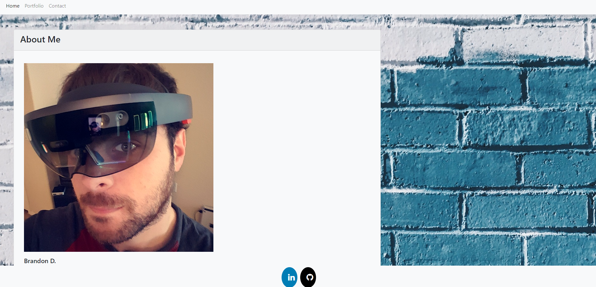
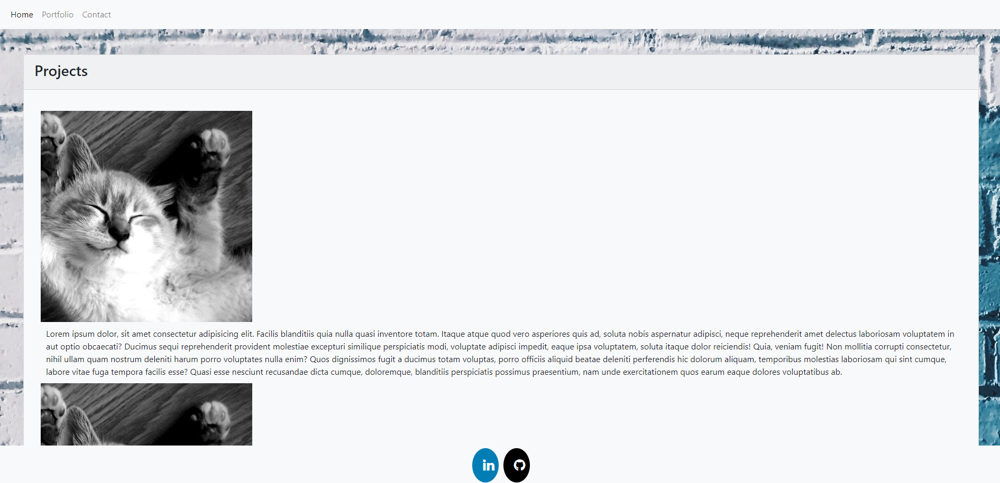
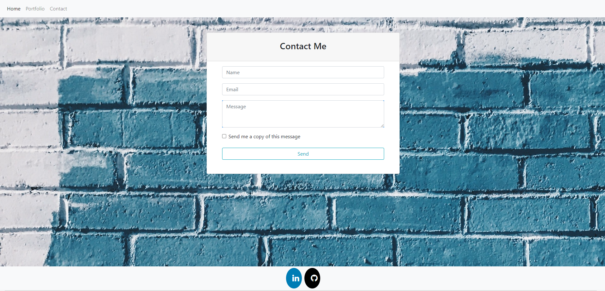

# BrandonD-Portfolio

## Description 

This is a portfolio website that I built using bootstrap. This will be updated throughout the course of the full stack development bootcamp. I created an index page which displays a quick about me and navigation:

The portfolio is currently empty as I have yet to build other projects in this course, this will be updated as I create new projects:

The contact page is currently just a placeholder, as I progress through the full stack course this will eventually have backend components to allow functionality: 

This site is hosted via github. Bootstrap 4 was utilized to build this mobile responsive website. 

[Github] (https://github.com/Brando2147/01-code-refactor) 
[Repo] (https://brando2147.github.io/01-code-refactor)
